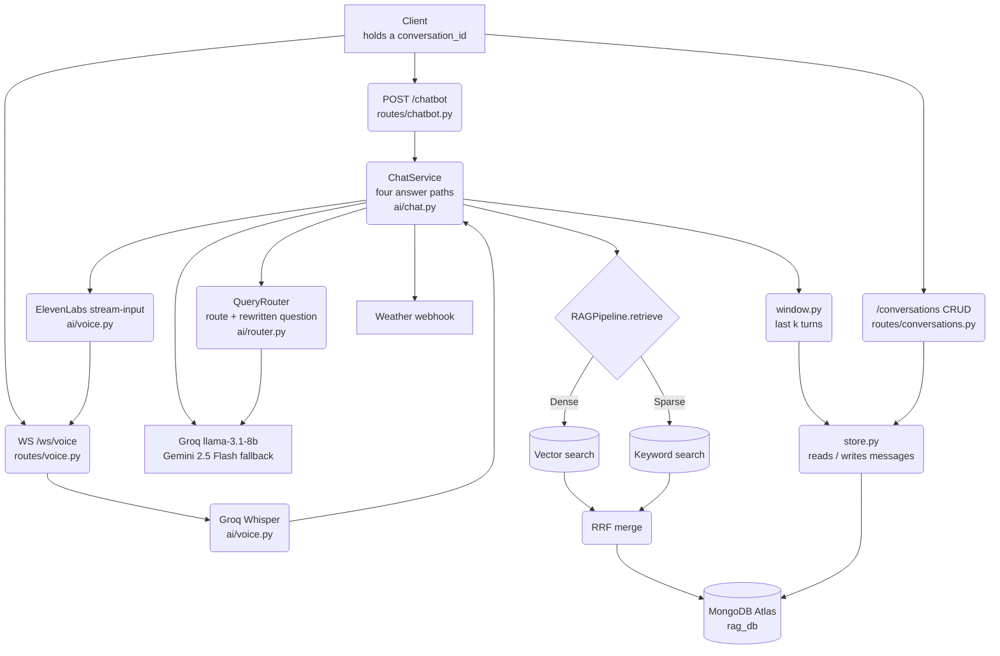
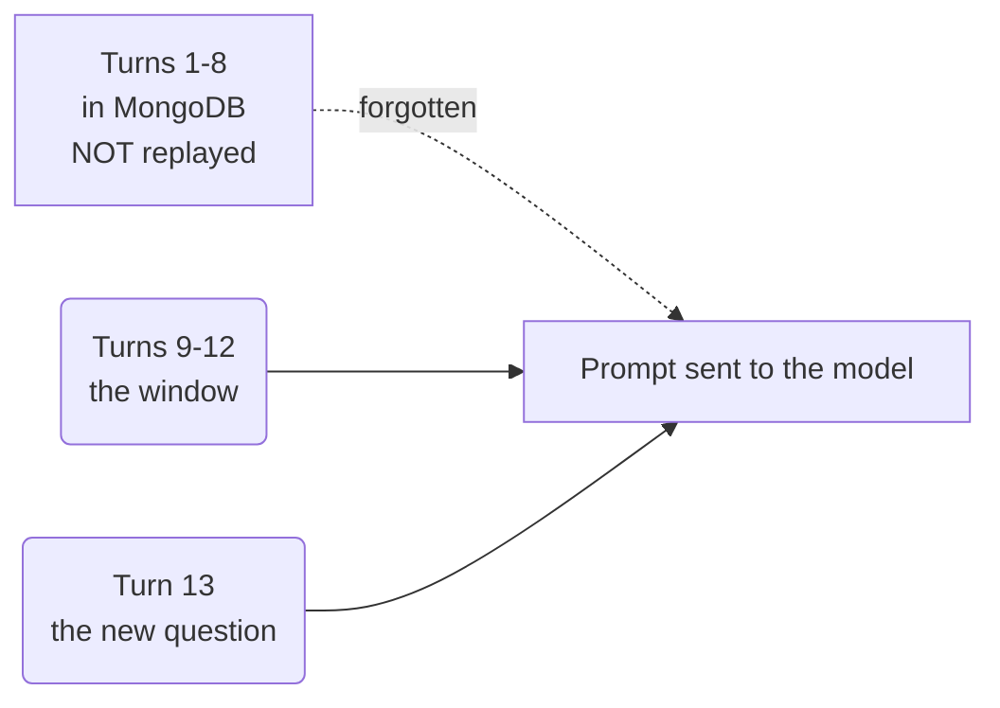
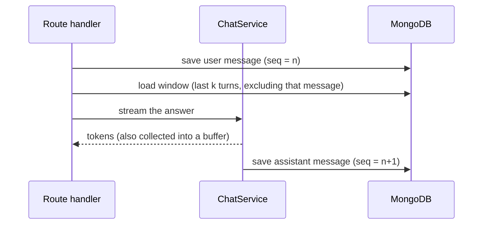

# System Architecture

> **How to read this document.** Start with §1 for the one-paragraph summary, then
> §2 for the map. §3–§8 walk through one request end to end. §9 collects the design
> decisions and the reasoning behind each one — that section is the most useful if
> you are learning from this codebase rather than working on it.
>
> The spoken path — microphone in, synthesised speech out — has its own walkthrough in
> [voice-mode.md](voice-mode.md).

---

## 1. What this system is

A **retrieval-augmented chatbot with persistent conversation memory**. A user asks a
question; the system decides *how* to answer it (search a document, call a tool, both,
or neither), remembers what was said before, and streams the answer back token by token.

Three ideas do most of the work:

| Idea | In one line |
|---|---|
| **Routing** | Not every question needs a database search. Decide first, then do only that work. |
| **Retrieval** | Answers about the resume come from the resume, not from the model's memory of the internet. |
| **Memory** | The last few exchanges are replayed to the model, so follow-up questions make sense. |

---

## 2. The map

Two ways in — a streaming HTTP endpoint for typed questions and a WebSocket for spoken
ones — converging on the same `ChatService`. Everything above the database is stateless;
all state lives in MongoDB, so restarting the server loses nothing.



**Why these boundaries?** `store.py` knows about MongoDB and nothing else — no LangChain
types, no LLM calls. `window.py` knows about LangChain messages but not about queries or
collections. That split means you can change how memory is *assembled* without touching
how it is *stored*, and vice versa.

---

## 3. The database

Three collections in `rag_db`. The first is the knowledge base; the other two are the chat.

### `vector_documents` — the knowledge base
Chunks of the ingested documents, each with a 768-dimensional embedding. Written once at
startup, read on every RAG query. See [workflow.md](workflow.md) §1.

### `conversations` — one document per chat thread

```jsonc
{
  "_id": "conv_9f8b2c1e-4a77-4d1e-9c33-6b0f5d2a1e88",
  "user_id": "default_user",
  "title": "Who is Harish",          // auto-derived from the first user message
  "message_count": 6,                 // doubles as the sequence allocator
  "last_message_preview": "He works at ...",
  "created_at": "...", "updated_at": "...",
  "deleted": false                    // soft delete
}
```

### `messages` — one document per message

```jsonc
{
  "_id": "msg_3c7d81a0-55be-42f2-8d94-71ab0c9e2f10",
  "conversation_id": "conv_9f8b2c1e-...",
  "seq": 3,                           // order within the thread: 0, 1, 2, 3, ...
  "role": "user",                     // or "assistant"
  "content": "and where did he study?",
  "route": "RAG",                     // assistant messages only
  "tool_calls": [ ... ],              // metadata only — see §6
  "partial": false,                   // true if the stream was cut short
  "created_at": "..."
}
```

**Indexes**
- `messages`: `(conversation_id, seq)` — **unique**
- `conversations`: `(user_id, updated_at desc)` — powers the sidebar

> **Teaching note — the unique index is not just for speed.** It is the last line of
> defence against two concurrent requests in the same thread being handed the same `seq`.
> The database refuses the duplicate rather than silently interleaving the conversation.

---

## 4. How a `seq` number is allocated

Every message needs a position in the thread, and two requests may arrive at once. The
allocation is therefore a **single atomic operation**:

```python
conversation = await self.conversations.find_one_and_update(
    {"_id": conversation_id, "deleted": {"$ne": True}},
    {"$inc": {"message_count": 1}, "$set": {"updated_at": now}},
    return_document=ReturnDocument.AFTER,
)
seq = conversation["message_count"] - 1
```

MongoDB guarantees `$inc` is atomic, so each caller gets a distinct number. Reading the
count and then writing `count + 1` in two steps would be a classic race.

---

## 5. The memory layer

### The window buffer

Replaying an entire conversation to the model would grow without bound and cost more on
every turn. Instead only the **last k turns** are replayed — a *window buffer*.

A **turn** is a user message *plus* its answer. The window is measured in turns rather
than raw messages on purpose: a window that cuts between a question and its answer hands
the model a dangling question and produces visibly confused replies.

| Setting | Default | Meaning |
|---|---|---|
| `WINDOW_K` | 4 | turns replayed normally |
| `WINDOW_K_LARGE` | 5 | turns once the thread is long |
| `LARGE_HISTORY_THRESHOLD` | 100 | turn count at which the wider window applies |

All three are read from `.env` via `app/core/config.py`, so tuning needs no code change.



Nothing is ever deleted — turns 1–8 stay in the database and are still returned by
`GET /conversations/{id}`. They are simply not sent to the model.

### What gets replayed — and what does not

Only plain user/assistant **text** is rebuilt into `HumanMessage` / `AIMessage`. Tool
activity is stored in the `tool_calls` field for observability but is **never** replayed.

> **Teaching note — why tool messages must not be replayed.** A tool call is a pair: an
> assistant message saying *"call `get_weather(Chennai)`"* and a matching tool message
> carrying the result. Replay the first without the second and the Groq API rejects the
> whole request with a 400. The finished answer already contains everything the tool
> produced, so nothing is lost by storing only the text.

### Where history goes in the prompt

History is spliced between the system prompt and the current question:

```python
messages = [
    SystemMessage(content=RAG_SYSTEM_PROMPT),   # the rules
    *self.history,                              # what was said before
    HumanMessage(content=f"Context:\n{context_text}\n\nQuestion: {self.user_prompt}"),
]
```

The system prompt stays first so its instructions are not buried, and the current question
stays last so it is the most recent thing the model reads.

---

## 6. The router — two jobs in one call

The router decides the route **and** rewrites the question so it stands on its own. Both
come back from a single model call:

```python
class RouteDecision(BaseModel):
    route: Literal["RAG", "TOOL", "BOTH", "DIRECT"]
    standalone_question: str
```

| Route | Meaning |
|---|---|
| `RAG` | Answer from the resume. Retrieval only. |
| `TOOL` | Answer from the weather tool. No retrieval. |
| `BOTH` | Needs the resume *and* the tool (e.g. weather in a city named in the resume). |
| `DIRECT` | Greetings, general knowledge — neither. |

### Why the rewrite matters

This is the part that makes memory actually useful for retrieval:

| Turn | User types | Router rewrites to | Searched for |
|---|---|---|---|
| 1 | "Who is Harish?" | "Who is Harish?" | ✅ |
| 2 | "what are his skills?" | "what are Harish Palanivel's skills?" | ✅ |
| 3 | "and where did he study?" | "Where did Harish study?" | ✅ |

Turn 3 on its own contains **no searchable terms at all** — embedding "and where did he
study?" returns nothing useful no matter how good the vector store is. The rewritten
question is what gets embedded.

> **Teaching note — why one call and not two.** The classic LangChain pattern uses a
> separate "condense question" chain before the router. That is cleaner in theory but
> doubles the latency on the critical path, and both jobs need exactly the same input
> (history + the new question). Merging them is free accuracy.

### Structured output with a fallback

```python
llm = primary_llm.with_structured_output(RouteDecision).with_fallbacks(
    [fallback_llm.with_structured_output(RouteDecision)]
)
```

> **Teaching note — the ordering rule.** `with_structured_output()` is applied to each
> *model* first, then the pair is wrapped in `with_fallbacks()`. Doing it the other way
> round fails: `with_fallbacks()` returns a `RunnableWithFallbacks`, which has no
> `with_structured_output()` method of its own. The same rule applies to `bind_tools()`
> in `chat.py`.

The router **never raises**. Any failure — bad JSON, an unrecognised route, a timeout —
degrades to `RAG` with the original question untouched.

---

## 7. Generation

### Dual model with automatic fallback

- **Primary**: Groq `llama-3.1-8b-instant` — fast and cheap
- **Fallback**: Google `gemini-2.5-flash` — used automatically when Groq errors or rate-limits

### The tool loop

There is no `AgentExecutor` and no LangGraph — the loop is written by hand in
`_run_tool_loop`, which makes the control flow completely visible:

1. Ask the tool-aware model what to do.
2. If it requested tools, run each one and append a `ToolMessage`.
3. Stream the final answer from the **plain** model, so it summarises the tool result
   instead of calling the tool again.

Because the loop is owned here, `ToolMessage` content is never yielded to the client —
raw webhook JSON cannot leak into the stream.

The tool itself (`app/tools/weather.py`) is an **async** tool built on a single shared
`httpx.AsyncClient`, created lazily and closed in the app's shutdown lifespan.

> **Teaching note — most of a "slow API call" was never the API.** The webhook's own work
> takes ~0.30s, but the tool span was measuring ~1.09s. The missing 0.7s was **connection
> setup**: the original implementation used `requests` with no session, so every single
> call paid a fresh DNS lookup, TCP handshake and TLS handshake before sending a byte.
> Reusing one client dropped the median to **0.36s**.
>
> Note what the fix was *not*. Making the tool `async` was not the win — LangChain already
> runs a sync tool in a thread pool when you `await` it, so it never blocked the event
> loop (measured: worst loop stall 19ms). Async is what makes a *shared connection pool*
> natural; the connection reuse is what saved the time. When something looks slow,
> measure the parts before rewriting the whole thing.

### One subtlety: content is not always a string

```python
def content_to_text(content) -> str:
    """Groq returns a str; Gemini can return a list of content parts."""
```

> **Teaching note.** Groq hands back `content` as a plain string, but Gemini — the
> *fallback* — can return a **list of parts**. Since the fallback fires exactly when Groq
> is rate-limiting, this shows up only under load. A raw list breaks two things at once:
> Starlette calls `.encode()` on whatever the stream yields, and the accumulator joins
> the tokens into one answer. Every yield site goes through `content_to_text()`.

---

## 8. Writing the answer back

The user message is written **before** the stream opens; the assistant message **after**
it finishes.



Writing the question first means it survives a crash mid-answer, and any failure — an
unknown `conversation_id`, a malformed body — surfaces as a proper JSON `4xx` instead of
an error string buried in the middle of a token stream.

### The abandoned-stream case

If the client closes the tab mid-answer, the partial text is still saved, flagged
`partial: true`. Getting this right required a split:

| Situation | How the write happens |
|---|---|
| Normal completion, or a handled error | **Awaited** — the next turn must not load history before this answer lands |
| Client disconnected (`GeneratorExit`) | Handed to an **independent task** |

> **Teaching note — why not just `await` in the `finally`?** Because it silently does
> nothing. An abandoned async generator is finalised by the event loop *after*
> `aclose()` has already returned, and an `await` at that point is cancelled — the write
> is issued and then dropped, with no error anywhere. Scheduling an independent task gets
> the write off the dying frame. The normal path stays awaited, because making *it*
> async too would let a fast follow-up question race a not-yet-saved answer.

---

## 9. Design decisions and why

| Decision | Reasoning |
|---|---|
| **Hand-written window memory, not `ConversationBufferWindowMemory`** | That class was **deleted in LangChain 1.0** — `langchain.memory` no longer imports. Its MongoDB backend was also blocking `pymongo`, which would stall the event loop inside these async endpoints. |
| **Not `RunnableWithMessageHistory` either** | The modern replacement wraps an **LCEL Runnable**. `ChatService` is a hand-written async generator with a manual tool loop, so adopting it would mean rewriting the streaming path to gain nothing. |
| **Window measured in turns, not messages** | Cutting between a question and its answer produces confused replies. |
| **UUID string ids with a `conv_` / `msg_` prefix** | Stored as plain `str`, so an id travels unchanged from Mongo → Python → JSON → the URL bar. The prefix makes a mistyped id fail fast (`422`, not a confusing `404`) and makes ids self-describing in logs. |
| **Router returns route *and* rewritten question** | One call, no extra latency, and retrieval finally works on follow-ups. |
| **Tool calls stored but never replayed** | Replaying a tool call without its result is a hard API error. |
| **Soft delete** | Messages stay on disk; an accidental click is not permanent. |
| **`X-Conversation-Id` response header** | The body is a raw token stream with nowhere to put metadata, and this keeps the existing response contract unchanged. |
| **State lives only in MongoDB** | The app layer is stateless, so restarts and multiple workers are safe. |
| **Voice uses raw PCM over a WebSocket, not WebRTC** | Push-to-talk on localhost has none of the problems WebRTC solves (echo, jitter, packet loss), and WebRTC hides the media path — the exact part worth teaching. See [voice-mode.md](voice-mode.md) §2. |
| **LLM clients built once per process, not per request** | Constructing `ChatGroq` + `ChatGoogleGenerativeAI` costs ~1.2 s **every time**, not just the first. Doing it per request put that in front of every answer. See [voice-mode.md](voice-mode.md) §8. |

---

## 10. File map

```
app/
├── main.py                  # FastAPI app, lifespan (LangSmith -> Mongo -> indexes -> ingest), CORS
├── core/
│   ├── config.py            # env settings, incl. the memory window knobs
│   ├── ids.py               # conv_/msg_ UUID generation + validation
│   └── tracing.py           # LangSmith helpers
├── db/
│   └── mongodb.py           # Motor client, collection accessors, index creation
├── memory/
│   ├── store.py             # persistence: conversations & messages (MongoDB only)
│   └── window.py            # window buffer: last k turns -> LangChain messages
├── ai/
│   ├── router.py            # QueryRouter -> RouteDecision(route, standalone_question)
│   ├── chat.py              # ChatService: 4 route branches, tool loop, persistence
│   ├── voice.py             # STT (Groq Whisper), TTS (ElevenLabs WS), sentence chunker
│   └── chain.py             # 3-stage LCEL chain: extract -> enrich -> format
├── rag/
│   ├── rag_pipeline.py      # ingest() / retrieve()
│   ├── vector_store.py      # Atlas $vectorSearch + $search + RRF
│   ├── embeddings.py        # Gemini embeddings, 768d
│   └── data_processor.py    # loaders + RecursiveCharacterTextSplitter
├── prompts/                 # router, RAG and per-route system prompts
├── routes/
│   ├── chatbot.py           # POST /chatbot
│   ├── voice.py             # WS /ws/voice  (push-to-talk turn loop)
│   └── conversations.py     # conversation CRUD
├── schemas/
│   └── chat.py              # Pydantic request/response models
└── tools/
    └── weather.py           # @tool get_weather
```

> **Note.** `chain.py` is a self-contained LCEL example and is not reachable from any
> endpoint — it is not part of the request path described above.

---

## 11. Observability

LangSmith traces are grouped per conversation via `thread_id`, so an entire chat reads as
one thread in the dashboard rather than a pile of unrelated runs. Each run also carries
`route`, `standalone_question` and `history_messages` as metadata — enough to answer
"why did this question get routed there?" without reproducing it locally.

Tracing is optional and never load-bearing: it is enabled by `LANGSMITH_TRACING=true`, and
a LangSmith outage cannot break a chat request.
