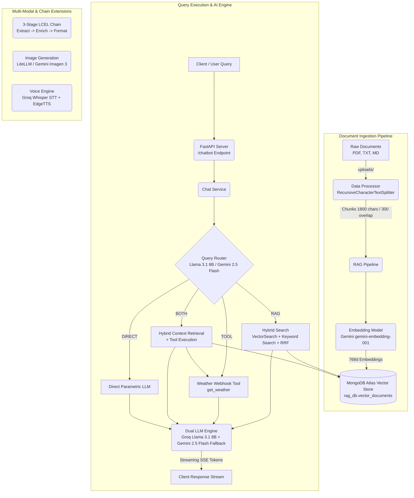

# System Architecture

The following diagram outlines the high-level architecture of the LangChain RAG & Multi-Modal AI system, showcasing how user queries are routed, retrieved via MongoDB Atlas Hybrid Search, and processed through dual LLM fallback chains.

### Core Architecture Components

- **FastAPI Server & Async Lifespan (`app/main.py`, `server.py`)**:
  - Serves API endpoints via Uvicorn.
  - Automatically initializes motor async MongoDB connection on boot and performs incremental document ingestion from the `uploads/` folder.

- **Data Processing & Chunking (`app/rag/data_processor.py`)**:
  - Parses `.pdf` (via `pypdf`/`PyPDFLoader`), `.txt`, and `.md` files.
  - Uses `RecursiveCharacterTextSplitter` with a chunk size of `1800` characters and an overlap of `300` characters to preserve semantic context boundaries.

- **Embeddings Generator (`app/rag/embeddings.py`)**:
  - Uses Google's `GoogleGenerativeAIEmbeddings` (`models/gemini-embedding-001`) to generate 768-dimensional dense vector embeddings.

- **MongoDB Atlas Hybrid Vector Store (`app/rag/vector_store.py`)**:
  - Performs **Hybrid Search** by executing parallel vector similarity search (`$vectorSearch`, cosine metric) and keyword text search (`$search`, BM25 algorithm).
  - Merges and re-ranks candidate results using **Reciprocal Rank Fusion (RRF)**.
  - Automatically manages and provisions Search Indexes (`vector_index` and `keyword_index`) using PyMongo's `SearchIndexModel`.

- **Query Router (`app/ai/router.py`)**:
  - Uses a lightweight, zero-temperature LCEL classification chain (`ROUTER_PROMPT | llm | StrOutputParser()`) to dynamically classify incoming prompts into `RAG`, `TOOL`, `BOTH`, or `DIRECT`.

- **Dual LLM & Fallback Mechanism (`app/ai/chat.py`)**:
  - **Primary Model**: Groq `llama-3.1-8b-instant`.
  - **Fallback Model**: Google Gemini `gemini-2.5-flash`.
  - Configured using LangChain's `.with_fallbacks()` runnable wrapper to guarantee high availability.

- **Tool Calling & Webhooks (`app/tools/weather.py`)**:
  - Integrates tool execution (e.g. `get_weather` hitting external webhooks) within a hand-written tool loop to prevent raw JSON tool messages from leaking into the user-facing token stream.

- **Multi-Modal Capabilities**:
  - **3-Stage LCEL Chain (`app/ai/chain.py`)**: Concept extraction (JSON) → Concept enrichment → Markdown report generation.
  - **Image Generator (`app/ai/image.py`)**: Gemini Imagen 3 image generation via LiteLLM.
  - **Voice Engine (`app/ai/voice.py`)**: Groq Whisper Turbo (`whisper-large-v3-turbo`) for Speech-to-Text and EdgeTTS (`en-IN-PrabhatNeural`) for Text-to-Speech synthesis.
