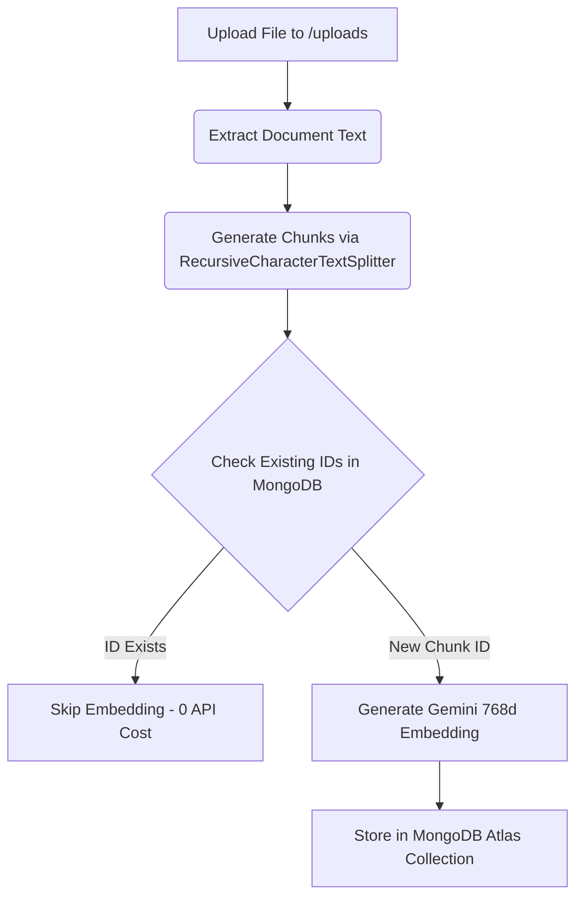

# Chunking & Ingestion Strategy

To efficiently retrieve relevant information and fit within LLM context window limits, documents are split into structured text chunks before being embedded and stored.

---

## Strategy Details

- **Splitter Class**: `RecursiveCharacterTextSplitter` (from `langchain_text_splitters`).
- **Chunk Size**: `1800` characters.
- **Chunk Overlap**: `300` characters.
- **Separators Hierarchy**: `["\n\n", "\n", " ", ""]`.
- **Embedding Model**: `models/gemini-embedding-001` (768 dimensions via `GoogleGenerativeAIEmbeddings`).

---

## Technical Rationale

1. **Semantic Boundary Preservation**: Unlike naive word counts, `RecursiveCharacterTextSplitter` attempts to split on natural paragraph breaks (`\n\n`) first, then line breaks (`\n`), and lastly spaces (` `). This prevents cutting sentences or key ideas in half.
2. **Context Continuity**: A 300-character overlap ensures that entities or concepts spanning across boundaries are preserved in consecutive chunks.
3. **Chunk Identification & Metadata**: Each chunk receives a deterministic ID based on its source document and sequential index (e.g., `my_resume.pdf-0`). Metadata retains the source filename for citation during generation.

---

## Incremental Ingestion & Deduplication

Before embedding, the pipeline fetches all existing chunk IDs from MongoDB Atlas (`get_existing_ids()`). Only newly added or updated chunks are processed, eliminating redundant API usage and accelerating startup times.
