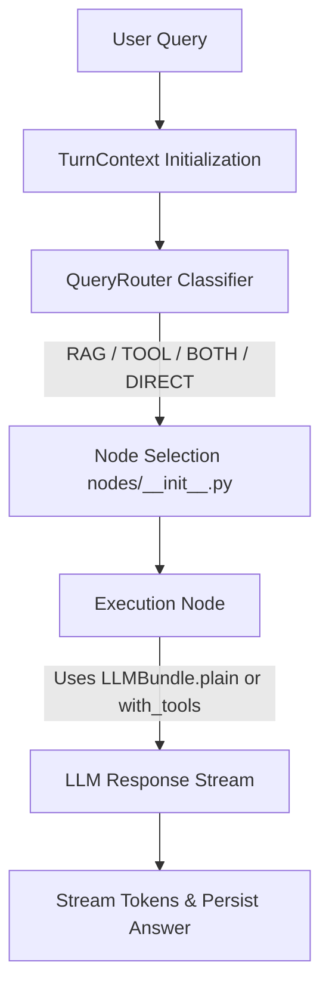

# Backend Architecture, Bug Fixes & Extensibility Guide

This document provides a detailed breakdown of the backend AI architecture, recent robustness fixes, internal design patterns (`LLMBundle`, `@lru_cache`, `base.py`), and step-by-step instructions for extending the system (adding Tools, MCP Servers, LLMs, and Execution Nodes).

---

## 1. Overview of Architecture & Turn Lifecycle

The backend operates as an **Intent-Routed Modular RAG System**:



### Turn Lifecycle Steps:
1. **Context Initialization**: `TurnContext` in `app/ai/chat/context.py` encapsulates `user_prompt`, `conversation_id`, `history`, `voice_mode`, and calculates `max_tokens`.
2. **Intent Classification**: `QueryRouter` in `app/ai/router/query_router.py` classifies the query into one of four routes (`RAG`, `TOOL`, `BOTH`, `DIRECT`) and rewrites the user question into a standalone query.
3. **Node Execution**: `ChatService` in `app/ai/chat/service.py` delegates to `nodes.select(route)`, executing exactly one streaming node function.
4. **Model Delivery**: Nodes consume pre-cached model pairs (`LLMBundle`) built in `app/ai/chat/models.py`.

---

## 2. Deep Dive: Key Internal Components

### 2.1 Node Interface Contract (`app/ai/chat/nodes/base.py`)
`base.py` defines the mandatory interface for all route execution handlers:
```python
Node = Callable[[TurnContext, LLMBundle], AsyncIterator[str]]
```
* **Decoupled Strategy**: Each node (`direct.py`, `rag.py`, `tool.py`, `both.py`) implements this identical signature.
* **Single Responsibility**: Nodes read inputs from `TurnContext`, borrow models from `LLMBundle`, and stream text tokens. They do not instantiate model clients, touch databases, or call the router.

### 2.2 Model Caching & Performance (`app/ai/chat/models.py`)
* **The Problem**: Building LangChain wrappers takes ~740ms for `ChatGoogleGenerativeAI` and ~490ms for `ChatGroq` (~**1.2s total**). Re-building models per HTTP/WebSocket request introduces unacceptable latency.
* **The Solution**: `@lru_cache(maxsize=4)` caches `LLMBundle` instances in RAM by `max_tokens`:
  * **Text Chat**: `DEFAULT_MAX_TOKENS = 500`
  * **Voice Mode**: `settings.voice_max_tokens = ~120`
* **Thread Safety**: LLM client instances are stateless HTTP wrappers, making them safe to share across concurrent requests.

### 2.3 `LLMBundle`: `plain` vs `with_tools`
`LLMBundle` is a dataclass containing two pre-configured model chains:
* **`llms.plain`**: Groq with Gemini fallback (no tools bound). Used by `DIRECT` and `RAG` nodes.
* **`llms.with_tools`**: Groq with Gemini fallback (tools bound to both models). Used by `TOOL` and `BOTH` nodes.

#### Why keep them separate?
* **Prompt & Token Efficiency**: Binding tool definitions injects JSON schemas into system prompts. Omitting tools for plain text or RAG turns saves tokens, reduces cost, and improves generation speed.
* **Fallback Order Safety**: `with_fallbacks()` returns a `RunnableWithFallbacks`, which lacks `.bind_tools()`. `models.py` binds tools to primary and fallback models *before* constructing the fallback chain.

---

## 3. Recent Robustness & Bug Fixes

The codebase includes key safety enhancements:

1. **Message Content Flattening (`app/ai/messages.py`)**:
   `as_text()` calls `content_to_text(message.content)` to handle multi-modal list/dict content structures (e.g. Gemini parts) cleanly without leaking Python `repr` syntax into router classifier prompts.
2. **TTS Task Cancellation Cleanup (`app/ai/voice/tts.py`)**:
   Wrapped `sender.cancel()` with `contextlib.suppress(asyncio.CancelledError)` in `stream_tts()`, preventing noisy `Task exception was never retrieved` warning logs when streams interrupt.
3. **ElevenLabs Quota Resilience (`app/ai/voice/tts.py`)**:
   `remaining_credits()` uses `.get()` and type-checking on `character_limit` and `character_count` to gracefully return `None` if third-party API payloads change.
4. **Defensive Telemetry Hooks (`app/core/tracing.py`)**:
   `drop_self` and `drop_plumbing` validate `isinstance(inputs, dict)`, ensuring tracing hooks never crash application request flows.

---

## 4. Extensibility & Developer Guide

### 4.1 How to Add a New Tool
1. **Create Tool Module**: Create `app/ai/tools/your_tool.py` decorated with `@tool`:
   ```python
   from langchain_core.tools import tool

   @tool
   def your_tool(query: str) -> str:
       """Clear docstring describing what the tool does (read by LLM)."""
       return "Result"
   ```
2. **Register in Registry**: Open `app/ai/tools/registry.py` and add `your_tool` to `TOOLS: list[BaseTool]`.

*`registry.py` is the single source of truth; tool binding and execution lookup update automatically.*

---

### 4.2 How to Integrate MCP (Model Context Protocol)
1. **Create MCP Client Adapter**: Build an async client in `app/ai/mcp/` that connects to your MCP server and fetches available tools.
2. **Convert to LangChain Tools**: Convert MCP tools to `BaseTool` objects using `langchain-mcp-adapters` or custom tool wrappers.
3. **Register at Startup**: Append converted tools to `TOOLS` in `app/ai/tools/registry.py` during process startup (`warm_up_models()`).

---

### 4.3 How to Add a New LLM Provider (e.g., Anthropic, OpenAI, Ollama)
1. **Add Configuration**: Add API keys/endpoints to `app/core/config.py`.
2. **Update `models.py`**: Instantiate the new client (e.g., `ChatAnthropic`) in `build_models()` inside `app/ai/chat/models.py`.
3. **Configure Fallbacks**: Set it as `primary_llm` or append to `with_fallbacks([])`.

---

### 4.4 How to Add a New Execution Node (New Route Path)
1. **Create Node Handler**: Create `app/ai/chat/nodes/your_node.py`:
   ```python
   from typing import AsyncIterator
   from app.ai.chat.context import TurnContext
   from app.ai.chat.models import LLMBundle

   async def stream(ctx: TurnContext, llms: LLMBundle) -> AsyncIterator[str]:
       # Custom node execution logic
       yield "Token"
   ```
2. **Register Node Route**: Add your node to `NODES` dictionary in `app/ai/chat/nodes/__init__.py`:
   ```python
   NODES = {
       "YOUR_ROUTE": your_node.stream,
       ...
   }
   ```
3. **Update Router Schema**: Add `"YOUR_ROUTE"` to `RouteDecision` literal in `app/ai/router/query_router.py`.
4. **Update System Prompt**: Update `ROUTER_SYSTEM_PROMPT` in `app/ai/prompts/router.py` explaining when the classifier should select `"YOUR_ROUTE"`.

---

## 5. File Location Quick Reference

| Area | Primary File | Description |
| :--- | :--- | :--- |
| **Node Contract** | [`app/ai/chat/nodes/base.py`](file:///c:/Users/haris/OneDrive/Documents/Visual%20Codes/GenAI-project/backend/app/ai/chat/nodes/base.py) | Defines `Node` signature |
| **Node Registry** | [`app/ai/chat/nodes/__init__.py`](file:///c:/Users/haris/OneDrive/Documents/Visual%20Codes/GenAI-project/backend/app/ai/chat/nodes/__init__.py) | Maps route string to node function |
| **LLM Caching** | [`app/ai/chat/models.py`](file:///c:/Users/haris/OneDrive/Documents/Visual%20Codes/GenAI-project/backend/app/ai/chat/models.py) | `@lru_cache` and `LLMBundle` definition |
| **Tool Registry** | [`app/ai/tools/registry.py`](file:///c:/Users/haris/OneDrive/Documents/Visual%20Codes/GenAI-project/backend/app/ai/tools/registry.py) | Single list of `TOOLS` bound to LLMs |
| **Intent Router** | [`app/ai/router/query_router.py`](file:///c:/Users/haris/OneDrive/Documents/Visual%20Codes/GenAI-project/backend/app/ai/router/query_router.py) | Route decision Pydantic model & chain |
| **Turn Context** | [`app/ai/chat/context.py`](file:///c:/Users/haris/OneDrive/Documents/Visual%20Codes/GenAI-project/backend/app/ai/chat/context.py) | Per-turn state and max token logic |
