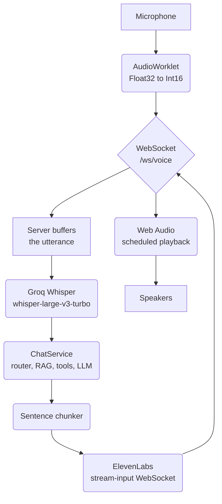

# Voice Mode

> **How to read this document.** §1–§3 are the concepts: what the pipeline is, why the
> transport was chosen, and what the wire protocol looks like. §4–§7 walk through every
> file that changed, in the order the audio flows through them. §8 is the performance
> work, which is where most of the real lessons are. §9 is what the free tier does and
> does not allow. §10 is how to verify it yourself.

---

## 1. What this is

Hold a button, speak, release. The system transcribes what you said, answers it with the
**same `ChatService` the text chat already uses**, speaks the answer back, and stores the
turn in the same conversation history.



The single most important property: **the answer starts being spoken before the LLM has
finished writing it.** Everything else is detail.

---

## 2. Why WebSocket + raw PCM, and not WebRTC

This is the decision students ask about first, because every production voice agent uses
WebRTC.

WebRTC gives you four things for free: **echo cancellation**, a **jitter buffer**,
**packet-loss concealment** over UDP, and **adaptive bitrate**. All four exist to solve
problems this project does not have:

| Problem WebRTC solves | Do we have it? |
|---|---|
| The AI's voice leaking back into an open mic | No — push-to-talk is half-duplex. The mic is closed while it speaks. |
| Packet loss / jitter on a mobile link | No — localhost. |
| Congestion needing bitrate adaptation | No — 32 KB/s on a loopback interface. |

What WebRTC costs is **visibility**. Its media path is SDP negotiation, ICE candidate
gathering, a DTLS-SRTP handshake, RTP packetisation, Opus encoding and a jitter buffer —
none of which you can inspect. Using LiveKit you write ~20 lines and understand almost
none of the pipeline; using `aiortc` you write ~150 lines of signalling and *still* cannot
see the media path.

With WebSocket + PCM the browser side is **~180 lines** (26 for the worklet, ~150 for
capture, playback scheduling and lifecycle) and the server side adds one `receive()` loop.
More importantly, you can put a `print(len(pcm))` anywhere in the chain and see real
bytes. For a teaching artifact that is the whole point.

**The honest trade.** This choice is correct *because* of push-to-talk on localhost. Add
barge-in over real networks and it inverts — you would need echo cancellation and loss
concealment, and rebuilding those by hand is a bad idea. The migration path is to keep
this version as the baseline and introduce Pipecat or LiveKit Agents as the contrast;
`ChatService` transfers unchanged because only the transport differs.

### Why raw PCM and not Opus

Opus would cut bandwidth from ~256 kbit/s to ~24, but needs a decoder on the server. On
loopback the bandwidth is free and the decoder is not. Raw PCM also means **no codec on
either side** — the browser produces it without an encoder and consumes it without a
decoder, which is what keeps `ffmpeg`, `pydub` and MediaSource out of the project entirely.

---

## 3. The wire protocol

One socket, `/ws/voice`, carrying both directions. Frame types are self-describing:
**binary is always audio, text is always JSON**. No envelope, no length prefix, no
sequence numbers — `if isinstance(msg, bytes)` is the entire demultiplexer.

| Direction | Frame | Meaning |
|---|---|---|
| client → server | binary | PCM16LE, 16 kHz, mono, 40 ms per frame |
| client → server | `{"type":"start","conversation_id":…}` | button pressed |
| client → server | `{"type":"end"}` | button released — run the turn |
| client → server | `{"type":"cancel"}` | abandon the utterance |
| server → client | `{"type":"transcript","text":…}` | what Whisper heard |
| server → client | `{"type":"token","text":…}` | one LLM token, for captions |
| server → client | binary | PCM16LE, 24 kHz, mono, synthesised speech |
| server → client | `{"type":"done","conversation_id":…}` | all audio sent |
| server → client | `{"type":"error","message":…}` | something went wrong |

Two sample rates because the two ends have different needs: Whisper works at 16 kHz and
anything more is wasted upload, while ElevenLabs returns 24 kHz and downsampling it would
only throw away quality.

---

## 4. `app/ai/voice.py` — the audio ends

This file was **rewritten from scratch**. What was there before was orphaned (nothing
imported it), imported two packages that were not installed (`litellm`, `edge_tts`), and
contained a bug worth studying:

```python
# The OLD code
output = await litellm.atranscription(model="groq/whisper-large-v3-turbo", file=audio_file)
response = completion(model='gemini/gemini-2.5-flash', messages=[
    {"role": "system", "content": "summarize the text short and crisp"},
    {"role": "user", "content": output.text}
])
return response.choices[0].message.content   # <-- returns a SUMMARY, not the transcript
```

A function called `speech_to_text` that returns a paraphrase of what you said. In a voice
assistant this is silently catastrophic: "cancel my 3pm meeting" might reach the LLM as
"user wants to change their schedule." **A transcription function must be verbatim.**

### `pcm_to_wav(pcm, sample_rate)`

Groq will not accept headerless PCM — it sniffs the container to pick a decoder. The
stdlib `wave` module writes a 44-byte WAV header into a `BytesIO`:

```python
buf = BytesIO()
with wave.open(buf, "wb") as w:
    w.setnchannels(1); w.setsampwidth(2); w.setframerate(sample_rate)
    w.writeframes(pcm)
```

**This is the trick that removes ffmpeg from the project.** No transcoding is happening —
we already have exactly the PCM a WAV file contains, so all that is missing is the header.

### `transcribe_pcm(pcm, sample_rate)`

Uses the already-installed `groq` SDK rather than adding `litellm`. The filename matters:

```python
file=("utterance.wav", wav, "audio/wav")
```

Groq picks its decoder from the extension, so a wrong name is rejected even when the bytes
are perfectly valid. Returns `resp.text` **unmodified**.

### `sentence_chunks(tokens)` — the latency lever

The highest-leverage function in the feature. It regroups a token stream into speakable
units:

- Feed ElevenLabs one token at a time → choppy, unnatural prosody.
- Feed it the whole answer → the first word is not spoken until the last is generated.
- Flush on sentence boundaries → **audio starts after the first sentence.**

It flushes on `[.!?]` followed by whitespace, or on a newline, or after 90 characters with
no punctuation in sight (so a rambling model still starts speaking).

**The abbreviation problem.** The first version split `"Dr. Reddy founded it."` into
`"Dr. "` and `"Reddy founded it."`, which is spoken as two utterances with a pause inside
the name — very noticeable, and guaranteed to come up at Dr. Reddy's Foundation.

The first fix was a length heuristic: do not flush a chunk shorter than 15 characters.
That was wrong — it swallowed the legitimate sentence `"Hello there."` (13 characters).
The working fix is an explicit set:

```python
_ABBREVIATIONS = {"dr", "mr", "mrs", "ms", "prof", "sr", "jr", "st", "vs", "etc", ...}
```

A boundary whose preceding word is in that set is skipped, and the search continues to the
next one. **The lesson is that a heuristic which cannot distinguish two cases is worse
than a short explicit list**, even though the list looks less clever.

### `class ElevenLabsStream`

A thin client over ElevenLabs' `stream-input` WebSocket, written with raw `websockets`
rather than the `elevenlabs` SDK. Text goes in while the LLM is still writing; audio comes
back while it is still writing. This overlap is exactly what the REST endpoints cannot do,
since they need the complete text up front.

Three details that are easy to get wrong:

1. **An initialising message is required before any text.** A bare `" "` sends the voice
   settings without speaking a word.
2. **An empty string means end-of-stream**, not "say nothing".
3. **Audio arrives base64-encoded inside JSON**, not as binary frames — it must be
   `base64.b64decode`d before being forwarded to the browser.

One instance per turn. Opening per turn also sidesteps the 20-second inactivity timeout
that a user pausing to think would otherwise trip.

### `stream_tts(chunks, on_audio, stream=None, opening=None)`

Sending and receiving run as **concurrent tasks**. Waiting for sentence one's audio before
sending sentence two would serialise away the entire benefit.

The `stream`/`opening` parameters let the caller start the ElevenLabs handshake early —
see §8.

### `warm_up()` and `remaining_credits()`

`warm_up()` transcribes 100 ms of silence at startup. `remaining_credits()` returns `None`
and logs an explanation rather than raising when the API key lacks the `user_read` scope —
it is telemetry, not a dependency, and must never take the app down.

---

## 5. `app/routes/voice.py` — the turn loop

New file. The endpoint itself is a plain loop over `websocket.receive()`:

```python
if (chunk := message.get("bytes")) is not None:
    audio.extend(chunk)      # mic audio for the utterance in progress
    continue
msg = json.loads(message["text"])   # otherwise a control message
```

Two guards on the buffer: `MAX_UTTERANCE_BYTES` (~60 s) stops a stuck client from growing
it without bound, and `MIN_UTTERANCE_BYTES` (~0.25 s) rejects a stray click before it
costs an API call.

**Origin checking is done by hand.** This surprises people:

```python
# CORSMiddleware does not apply to WebSocket handshakes — Starlette runs it on
# HTTP requests only — so the check has to happen here or not at all.
```

`allow_origins=["*"]` in `main.py` provides **zero** protection for this endpoint.

### `run_turn` — one utterance in, one spoken answer out

The conversation bookkeeping is deliberately identical to `POST /chatbot`: write the user
message **before** the answer starts (so the question survives a crash mid-turn) and load
the history **after** that write (so the model is not shown its own question twice).

`ChatService` needed no changes to be reused here. It is already an async generator of
plain text tokens, which is exactly what the TTS chunker consumes.

### `class Turn` — measure, do not guess

A tiny timer that logs each stage of every turn:

```
voice turn (1.7s audio)  stt=+537ms  memory=+205ms  first_audio=+1736ms  tts_done=+174ms  TOTAL=2652ms
```

This is the most valuable artifact in the feature for teaching. Every optimisation in §8
was found by reading this line, and two of the four guesses made beforehand were wrong.

---

## 6. `app/ai/chat.py` and the voice prompt

### `voice_mode` flag

`ChatService.__init__` gained one optional parameter. It does two things:

```python
if voice_mode:
    self.history.insert(0, SystemMessage(content=VOICE_SYSTEM_PROMPT))
max_tokens = settings.voice_max_tokens if voice_mode else 500
```

Injecting the prompt at the head of the history — rather than editing each of the four
branch generators — means it applies to `RAG`, `TOOL`, `BOTH` and `DIRECT` alike, and
lands immediately after whichever system prompt that branch uses.

### `app/prompts/voice_prompt.py`

New file. Spoken answers need different shaping from written ones:

- **2–3 sentences**, because nobody wants a 2000-character monologue read aloud.
- **No markdown** — every asterisk and hash is pronounced.
- **Numbers written as spoken**: "nineteen eighty-four", not "1984".

The token cap is also a cost control: on the ElevenLabs free tier a single 2000-character
reply is a tenth of the month's credits (§9).

---

## 7. The frontend

### `public/pcm-worklet.js`

Must live in `public/` because AudioWorklet modules are fetched **by URL at runtime**, not
imported through the bundler.

It runs on the audio rendering thread, which must never block — no fetch, no logging, no
allocation beyond the outgoing buffer. It buffers the browser's 128-sample blocks up to
640 samples (40 ms at 16 kHz) and converts Float32 → Int16:

```js
const s = Math.max(-1, Math.min(1, this.buffer[j]));
pcm[j] = s < 0 ? s * 0x8000 : s * 0x7fff;
```

The clamp matters. Web Audio legally produces values outside `[-1, 1]`, and without
clamping those **wrap around** when cast to an integer — turning a loud moment into a
burst of noise rather than clipping.

### `src/lib/voice-socket.ts`

Two independent `AudioContext`s, because capture and playback run at different rates.

**Capture.** The context is requested at 16 kHz:

```ts
new AudioContext({ sampleRate: MIC_SAMPLE_RATE })
```

The browser then resamples from whatever the hardware runs at (usually 48 kHz). Doing this
by hand — dropping every third sample — would alias badly. The mic node is deliberately
**not** connected to `destination`; routing it to the speakers would echo.

**Playback — the scheduling queue.** This is the part worth reading twice. Audio chunks
arrive from the network *faster than real time*. Playing each on arrival overlaps them
into noise. Instead each chunk is scheduled to begin where the previous one ended:

```ts
const startAt = Math.max(ctx.currentTime, this.playCursor);
source.start(startAt);
this.playCursor = startAt + buffer.duration;
```

The `Math.max` re-syncs the cursor if the network fell behind and the queue actually
drained. That is roughly 40 lines and needs no MediaSource Extensions and no decoder —
the payoff for choosing PCM over MP3.

Note `ws.binaryType = "arraybuffer"`. Without it every chunk arrives as a `Blob` needing an
async read before it can be scheduled.

### `src/stores/voice-store.ts`

A four-state machine — `idle → recording → thinking → speaking` — mirroring the shape of
`chat-store.ts`. The `VoiceSession` itself is held in a module variable, **not** in the
store: it owns AudioContexts and a socket, which are not state and must never be cloned by
a state update.

On `done` it appends the finished message into `chat-store`, so voice turns appear in the
normal transcript and survive a page reload through the existing
`GET /conversations/{id}`.

### `src/components/chat/chat-input.tsx`

The dead stub — `toast.info("Voice mode coming soon!")` — became real handlers. Pointer
events rather than mouse events, so touch and pen work with the same code, plus:

```tsx
e.currentTarget.setPointerCapture(e.pointerId);
```

Without pointer capture, sliding a finger off the button before releasing means the
`pointerup` never arrives and **the microphone records forever**.

`Escape` cancels an in-flight utterance, and unmounting closes the socket, the mic and
both AudioContexts.

---

## 8. Performance — where the time actually went

Target: under 1.5 s from button release to the first spoken word. First working version:
**5763 ms**. Every fix below came from reading the `Turn` log line, and the biggest one
was not in the voice code at all.

| Change | First audio |
|---|---|
| First working version | 5763 ms |
| Cache LLM clients per process | 2482 ms |
| Open ElevenLabs socket concurrently; overlap conversation lookup with STT | **~1300 ms** |

### The big one: LLM clients were rebuilt on every request

The original `ChatService.__init__` constructed `ChatGroq` and `ChatGoogleGenerativeAI`
inline. Measured:

```
ChatService.__init__  #1:  1215.4 ms
ChatService.__init__  #2:  1189.0 ms
ChatService.__init__  #3:  1221.3 ms
```

**Not a cold start — a flat 1.2 s on every single request**, and the existing text chat was
paying it too, on every `POST /chatbot`. They are stateless HTTP clients, so they are now
built once per token budget:

```python
@lru_cache(maxsize=4)
def _build_models(max_tokens: int): ...
```

Result: 1215 ms → **0.03 ms**. Cached on `max_tokens` because that is the only thing that
varies (500 for text, 120 for voice), giving two entries.

> **The teaching point.** The voice feature did not create this problem; it made it
> visible. A 1.2 s constant is invisible in a chat UI where answers stream for several
> seconds anyway, and intolerable in a voice UI. *Latency-sensitive features expose
> pre-existing waste.*

### Overlapping the dead time

Two things were happening in sequence that had no dependency on each other:

```python
# The ElevenLabs handshake needs no text, so start it now and let it run
# alongside the router and the LLM.
tts = ElevenLabsStream()
opening = asyncio.create_task(tts.open())
```

By the time the first sentence exists, the socket is already open. Likewise, finding the
conversation does not depend on *what was said*, so it runs alongside transcription rather
than queueing behind it.

### Two guesses that were wrong

Worth recording, because the debugging process is the lesson:

1. **"The router is the bottleneck."** The plan flagged `QueryRouter` as the main latency
   risk. Measured in isolation it is **183 ms median** — cheaper than a plain first token.
   The 4.1 s first observed was cold-start plus the model-construction cost above.
2. **"Warm-up will fix the first turn."** Warming the Groq connection at startup helped
   less than expected; run-to-run variance from the upstream APIs dominates it.

### Honest numbers

Six consecutive warm turns, button release → first audible word:

```
2225 ms, 1297 ms, 1112 ms, 1336 ms, 3131 ms, 4128 ms
```

**Median ~1.3–1.8 s, with real outliers past 4 s.** The spread is upstream Groq and
ElevenLabs variance, not local code. Transcript text appears at ~210 ms, which is what
makes the wait feel shorter than it is — the user sees their own words almost immediately.

---

## 9. What the ElevenLabs free tier allows

Verified against a live free-tier key, not assumed:

| | Free tier |
|---|---|
| `pcm_24000` output | ✅ Works — only `pcm_44100`/`wav_44100` need Pro |
| WebSocket `stream-input` | ✅ Works |
| `eleven_flash_v2_5` | ✅ Works, and bills at **0.5 credits/char** |
| **Library voices** | ❌ **Rejected** — `1008 Free users cannot use library voices` |
| Concurrency | 2 (irrelevant at single-user) |
| Commercial use | ❌ Not permitted; attribution required |

**Voice IDs that work on free tier** (probed directly — Rachel, Josh, Domi and Sam are
library-gated and fail):

| Voice | ID |
|---|---|
| Sarah *(default)* | `EXAVITQu4vr4xnSDxMaL` |
| Adam | `pNInz6obpgDQGcFmaJgB` |
| Antoni | `ErXwobaYiN019PkySvjV` |
| Arnold | `VR6AewLTigWG4xSOukaG` |
| George | `JBFqnCBsd6RMkjVDRZzb` |
| Jessica | `cgSgspJ2msm6clMCkdW9` |
| Daniel | `onwK4e9ZLuTAKqWW03F9` |

### The credit budget

10 000 credits/month at 0.5 credits/char = **~20 000 characters of speech**. At the text
path's `max_tokens=500` (~2000 chars) that is **20 turns for the whole month**. Hence the
short-answer voice prompt: ~200 chars/turn ≈ **200 turns/month**.

`TTS_CACHE_ENABLED` replays identical phrases from disk during development so iterating on
the frontend costs nothing.

---

## 10. Verifying it

Run these in order; each one isolates a different seam.

**1. The codec seam** — does PCM survive the WAV wrapper and come back verbatim?
Synthesise a sentence, feed the PCM straight back into `transcribe_pcm`, and assert word
overlap. This is where the old code was broken, so it is checked first.

**2. The chunker** — pure logic, no API calls, no credits. Assert the output is lossless
apart from boundary whitespace, and that `"Dr. Reddy founded it."` stays in one piece.

**3. The ElevenLabs socket alone** — confirms the tier, the voice ID and the output format
*before* any browser is involved. Failed handshakes cost nothing; a rejection closes the
socket before generation.

**4. One full turn without a microphone** — stream a pre-made 16 kHz PCM file over
`/ws/voice` in 40 ms frames with `asyncio.sleep` between them, exactly as the worklet
would. This exercises everything except `getUserMedia`.

**5. The origin allowlist** — connect with `Origin: https://evil.example.com` and confirm
the handshake is rejected.

**6. In the browser** — hold the mic button, speak, release. Expect the transcript in
~0.2 s and speech in ~1.3 s. Watch the `voice turn …` line in the server log.

**7. Regression** — `POST /chatbot` must still stream, since `ChatService` is shared.
