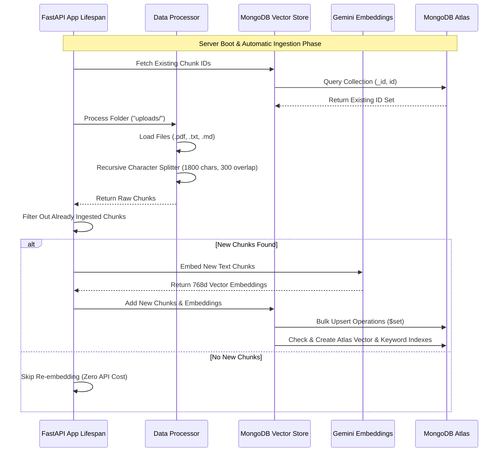
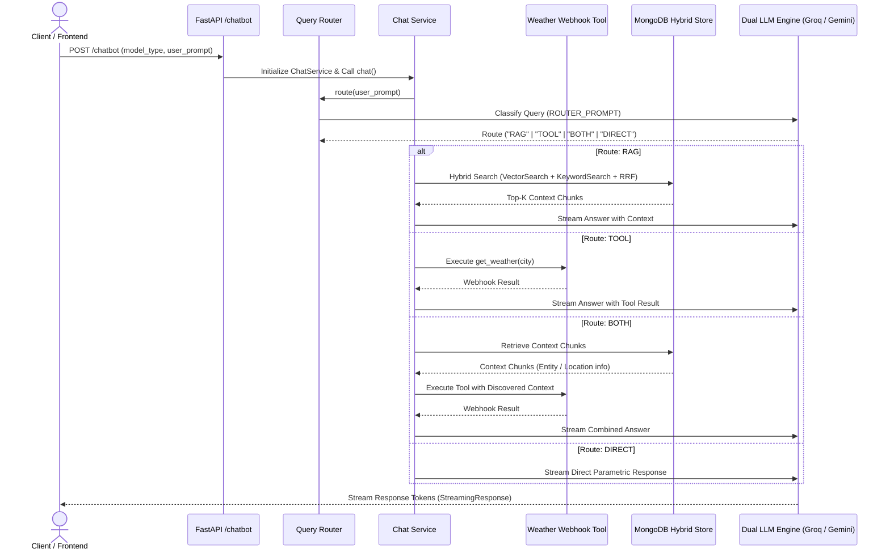

# RAG & Application Workflows

This document details the operational workflows of the system: **Document Ingestion** (indexing raw text into MongoDB Atlas) and **Query Routing & Execution** (answering user requests via dynamic routes).

---

## 1. Document Ingestion Workflow

Ingestion executes automatically on server startup via FastAPI's `lifespan` handler. It scans the `uploads/` folder, processes new or updated documents, and indexes them incrementally into MongoDB Atlas.

---

## 2. Dynamic Query Routing & Execution Workflow

When a user submits a query to the `/chatbot` endpoint, the system routes the request dynamically to optimize accuracy and resource usage.

